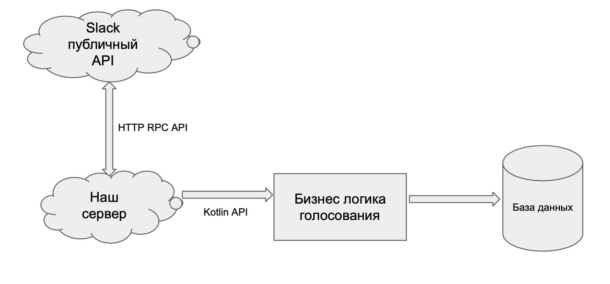
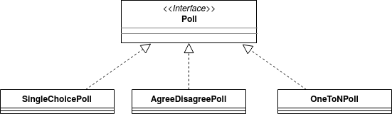
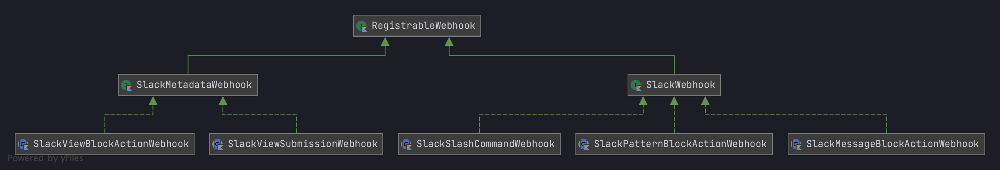
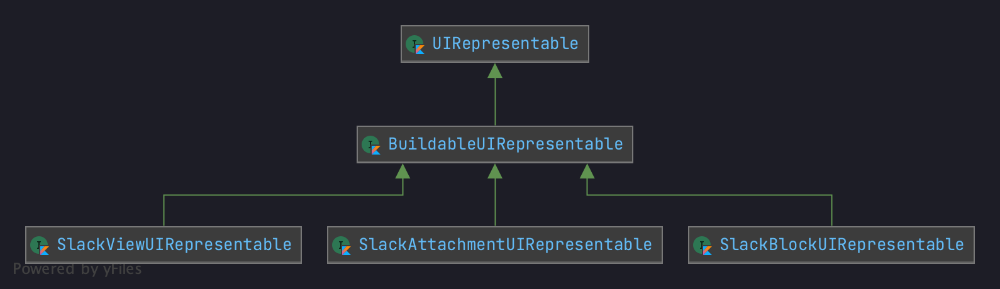
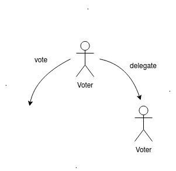
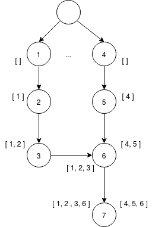
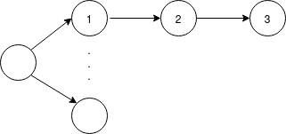
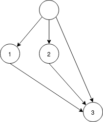
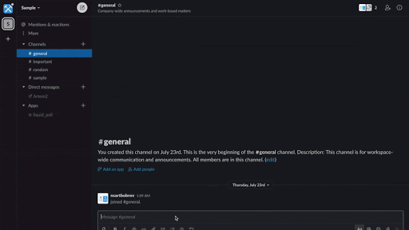

# Subcontractor docs
- [Используемые технологии](#используемые-технологии)
- [Архитектура](#архитектура)
  - [Базовая архитектура](#базовая-архитектура)
    - [Модули](#модули)
        - [subcontractor-core](#subcontractor-core)
             - [logic](#logic)
             - [model](#model)
         - [subcontractor-slack-server](#subcontractor-slack-server)
             - [Webhooks](#webhooks)
             - [UI](#ui)
- [Голосование: принципы, сбор результатов](#голосование:-принципы,-сбор-результатов)
    - [Список доступных действий](#список-доступных-действий)
    - [Основные принципы делегирования](#основные-принципы-делегирования)
    - [Получение результатов голосования](#получение-результатов-голосования)
    - [Теги и перманентное делегирование голоса](#теги-и-перманентное-делегирование-голоса)
- [Примеры работы приложения](#примеры-работы-приложения)
  

## Используемые технологии

* Kotlin
* Spring
* Java Slack SDK
* PostgeSQL

# Архитектура

## Базовая архитектура

## Модули

## subcontractor-core

Состоит из двух частей: logic и model.

### logic

В logic находится реализация итерфейса Dispatcher. Dispatcher реализует модель иерархического управления
задачами в общем виде (в терминах заказчик/исполнитель):

- создание заказов

- делегирование заказов

- выполнение заказов

- получение результатов

Dispatcher параметризуется типом результата выполненного заказа.

Dispatcher имеет доступ к базе данных через итерфейс DataStorage. Методы DataStorage позволяют 
сохранять, модифицировать и получать всю информацию, необходимую для реализации логики Dispatcher.

### model 

В model реализована модель голосования в общем виде (без привязки к Slack).

Иерархия для типа голосования выглядит так: 

В model.service находится реализация итерфейса VotingBusinessLogic, методы 
которого представляют логику голосования.  

Реализация VotingBusinessLogic использует методы Dispatcher.

VotingBusinessLogic  имеет доступ к базе данных через итерфейс PollInfoStorage. Методы PollInfoStorage позволяют 
сохранять, модифицировать и получать всю необходимую информацию о голосовании. 

## subcontractor-slack-server

### Webhooks

Slack запрашивает некоторую информацию по нужным событиями (например, нажатие на кнопку, запрос действия по команде и т.д.). К коде определяется понятие `Action`, которое и вызывется по команде.

За `Action` стоит некоторая иерархия, которая позволяет регулировать ответ в зависимости от вызываемого контекста.
Slack public API устроено неоднородным образом, то есть в зависимости от того, является ли событие ответ на команду, нажатие на кнопку в сообщении или в модальном окне на наш сервер будет отправляться разная информация. Эта иерархия позволяет за этим следить.

### UI

Slack предоставляет свой фреймворк для разработки интерфейсов сообщений, состоящий из готовых компонентов.

В коде реализована дополнительная иерархия классов, целью которой является переиспользование кастомных компонентов. Так как сообщение в чате(BlockView), модальные окна(View) и приложения к сообщениям(Attachment) задаются разными способами, это иерархия позволяет обобщить данные компоненты и использовать их в SlackProvider для отправки запросов по Slack public API.

## Голосование: принципы, сбор результатов

Модуль subcontractor-core реализует логику голосования по типу "жидкой демократии".
Это значит, что голосующий может проголосовать сам или отдать свой голос другому, при условии,
что, при делегировании не возникло цикла.

### Список доступных действий

   - проголосовать

   - отменить свой голос

   - делегировать голос

   - отменить делегирование

   - добавить правило делегирования 

   - получить результаты голосования

### Основные принципы делегирования

- Каждый запрос о делегировании включает список всех пользователей, которые заказали голос.
Проверка наличия цикла делегирования происходит так: проверяется, что текущего пользователя нет в этом списке.

- Ситуация двойного делегирования: если пользователь делегировал одному, а потом другому,
то при получении результатов учитывается только последний запрошенный результат

- Отмена делегирования не обнуляет предыдущий голос пользователя

### Получение результатов голосования 

При голосовании пользователя результат перезаписывается, при условии, что никто 
из заказчиков голоса не изменил свое решение о делегировании.

Допустим, 1 пользователь делегировал голос 2, а 2 делегировал 3:

Пусть сначала проголосовал 2: голос пришел по  цепочке 2 -> 1

Затем проголосовал 3: голос пришел по цепочке 3 -> 2 -> 1

Итоговым результатом в этом случае будет голос, пришедший по цепочке 3 -> 2 -> 1.

То есть итоговый результат -- это последний (по времени) результат.

Допустим, участники голосования -- пользователи 1, 2, 3. Пусть 1 и 2 делегировали свой голос 3:

Тогда голос 3 засчитывается сразу за 1, 2 и 3. 

### Теги и перманентное делегирование голоса

При создании голосования можно добавить теги -- ключевые слова, которые будут связаны с этим голосованием.

Для каждого пользователя (по его userID) можно установить набор правил делегирования.
Правило делегирования -- это пара: (множество тегов, id), где id -- это id пользователя, которому хотим делегировать голос 
при голосовании с данным набором тегов.

Если пользователю пришло голосование с множеством тегов, совпадающим с множеством тегов какого-либо 
одного из его правил делегирования (множества должны совпасть точно), то его голос автоматически делегируется
тому пользователю, id которого указан в правиле (если отсутствует цикл при делегировании).

Правила делегирования можно удалять. 

## Примеры работы приложения

mple](./resources/example.gif)